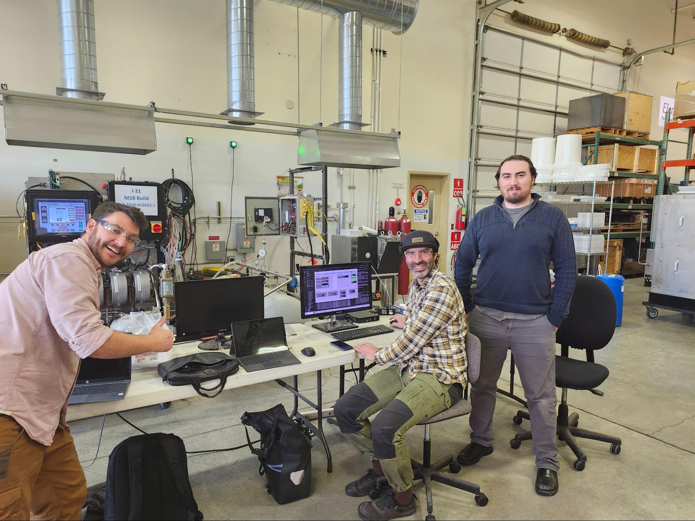
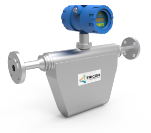
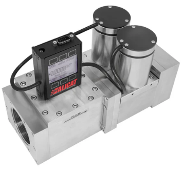
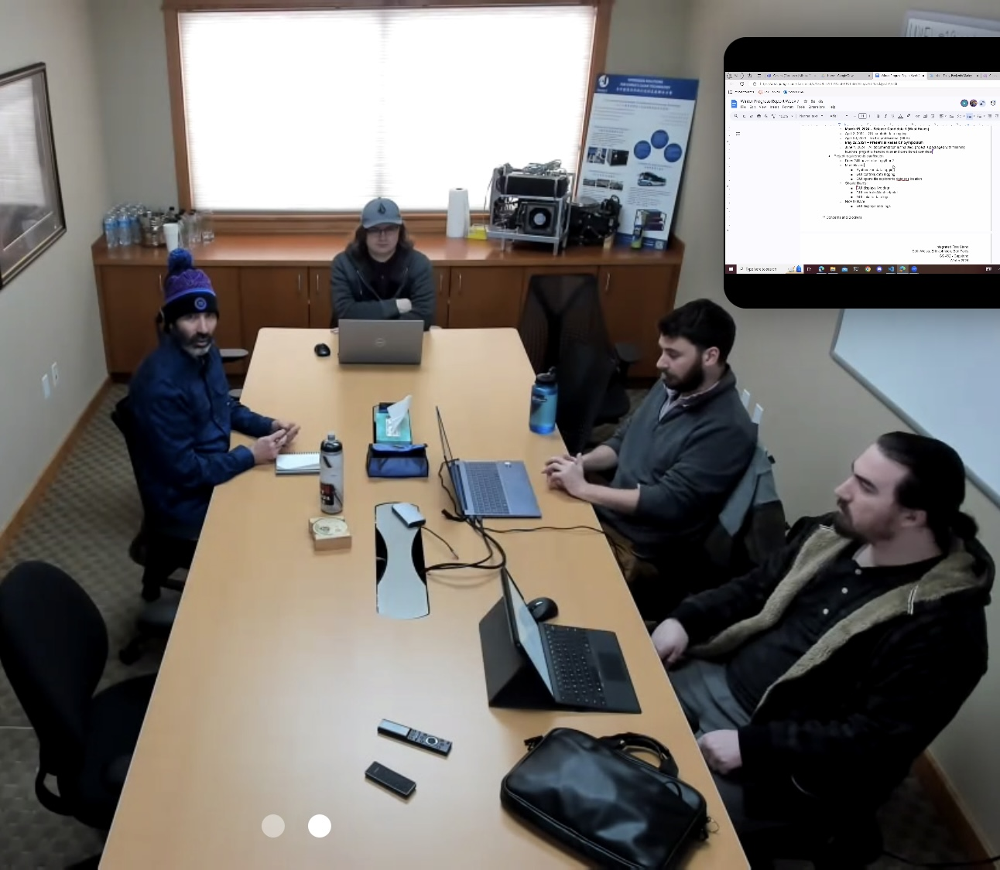
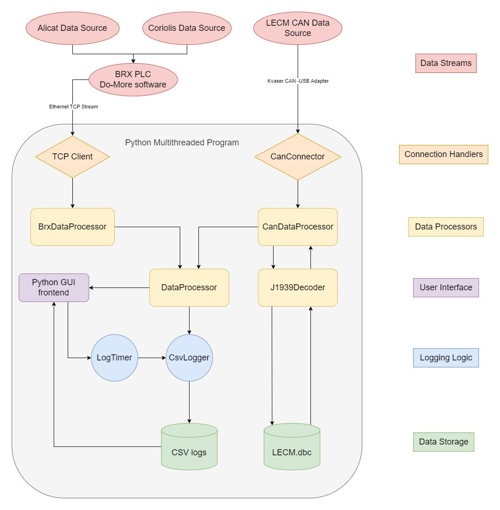
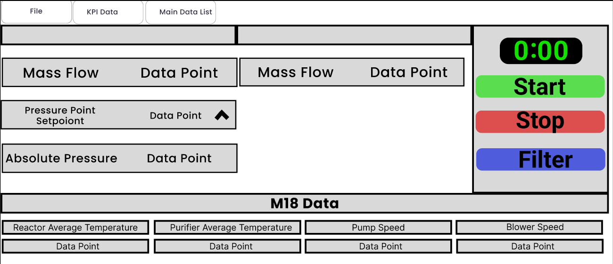
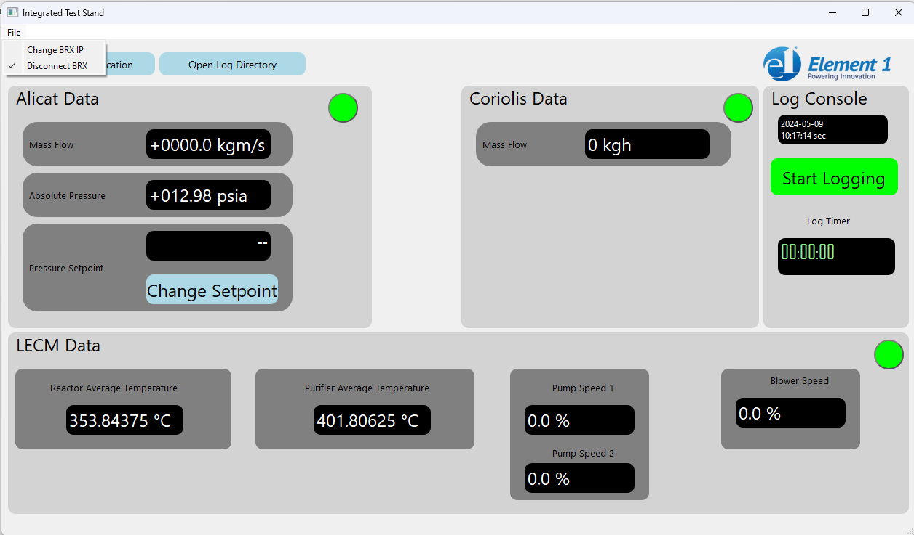

<!-- Copy and paste the converted output. -->

<!-----

You have some errors, warnings, or alerts. If you are using reckless mode, turn it off to see inline alerts.
* ERRORs: 0
* WARNINGs: 0
* ALERTS: 11

Conversion time: 3.173 seconds.

Using this Markdown file:

1. Paste this output into your source file.
2. See the notes and action items below regarding this conversion run.
3. Check the rendered output (headings, lists, code blocks, tables) for proper
   formatting and use a linkchecker before you publish this page.

Conversion notes:

* Docs to Markdown version 1.0β36
* Wed May 15 2024 21:41:07 GMT-0700 (PDT)
* Source doc: IntegratedTestStand_PublicLandingPage
* This document has images: check for >>>>>  gd2md-html alert:  inline image link in generated source and store images to your server. NOTE: Images in exported zip file from Google Docs may not appear in  the same order as they do in your doc. Please check the images!

----->
# Integrated Test Stand

### A Computer Science Capstone Project for Oregon State University – Cascades

Group members: [Ben Foley](https://github.com/Benjaminfoley), [Eric Johnson](https://github.com/ehjohnson154), [Seth Weiss](https://github.com/sweisss)

Project Partner: [Element 1](https://www.e1na.com/)

## Jump To

- [Intro](#intro)
- [Background](#background)
- [Process](#process)
- [Results](#results)
- [What We Learned](#what-we-learned)

## Intro

The Integrated Test Stand is a Capstone project for the Computer Science program at Oregon State University – Cascades. This has been a year-long project in which we (Ben, Eric, and Seth) developed a synthesized data logging program for our project partner, Element 1. Previously, E1 had been logging performance data from different devices in separate locations and then spending valuable time manually combining them for analysis. Our project integrates three of these main devices and synthesizes the data logging so they can spend more time analyzing performance and less time doing busy work in Microsoft Excel. As a bonus, we also designed and built a graphical user interface (GUI) for the engineers to more easily monitor the live data and interact with the logging process. 

This is a blog post describing the Integrated Test Stand Capstone project. This post serves as a public landing page for the project. The reason we are writing a blog post rather than making an official website full of fancy marketing images and information is that our project is under NDA, uses a private GitHub repository, and is exclusively intended for use by the engineers at Element 1. The result of this project will not be for sale to the public nor the customers/partners of Element 1. However, as a result of the NDA, this blog post will not only focus on the goals and results of the project, but emphasize the process and our development journey.

_The Integrated Test Stand Team. From left to right: Ben Foley, Seth Weiss, Eric Johnson._

## TL;DR

Ben, Eric, and Seth are seniors in the Computer Science program at Oregon State University – Cascades. They made a program for the engineers at Element 1 which allows for easier and less time consuming data gathering on R&D performance runs of hydrogen reformers. The project takes data gathered from three different devices and synthesizes logging of the data points into a single location. The project also provides a GUI for the engineers to more easily interact with both the program and the data points. 

## Background

Element 1 is a company here in Bend, OR that designs and fabricates small-scale hydrogen reformers. The reformers take a methanol feedstock, heat it up past its vaporization temperature, and perform a series of proprietary filtration processes to separate the pure hydrogen gas from the rest of the gaseous mixture. The pure hydrogen then exits the reformer where it can be attached to a compressor for storage or used in whatever application is desired. 

<body>

</body>

_Element 1 designs and fabricates the hydrogen reformers (left) which can be attached to a buffer tank (center) and subsequent storage devices (right)._

The main product that Element 1 sells is actually the technology and design as well as the license to manufacture the reformers. Because of this, the company is heavily focused on R&D and they run a lot of performance trials which utilize a number of flow meters and sensors to gather essential data and performance metrics. Three key devices used in these metrics are a Coriolis flow meter which measures various properties of the methanol feedstock, an Alicat flow controller which measures various properties of the hydrogen output as well as controls the flow rate, and a [CAN bus](https://www.csselectronics.com/pages/can-bus-simple-intro-tutorial) network known as the LECM (large engine control module) which monitors a number of internal sensors (pump speeds, reactor temperatures, etc.). 

<!--  -->
<!--  | 
:-------------------------:|:-------------------------: -->

_The Coriolis flow meter (left) measures the flow rate (among other aspects) of the methanol feedstock. The Alicat flow controller (right) measures various aspects of the hydrogen output as well as restricts and controls the flow rate._

Previously, the engineers at Element 1 had been logging data from the different devices in separate locations and then spending valuable time manually combining them for analysis. Rather than continue this process, they decided to come to us to partner in our Capstone project in which we decided to build a synthesized logging program. Because the engineers also value the ability to view live data during these performance runs, we agreed to build a graphical user interface for them to monitor key performance indicators (KPIs) alongside the logging. 

## Process

The development process can be broken down into three main sections which more or less line up with the academic quarters of Oregon State’s schedule. These phases, in chronological order, are the physical wiring and establishing communication of the devices, developing the backend synthesis and data logging program, and implementing and polishing the GUI. These phases were preceded with a documentation and design phase in which we established the ground rules and expectations of the project. The results of this phase were a number of official documents including a Product Requirements Document (PRD), Software Design Architecture (SDA), and Software Development Process (SDP). It’s important to note that emphasized the “living” aspect of these documents, as we wanted to give ourselves enough flexibility to adapt and change the project design and requirements as needed. Indeed, although the major design phase preceded the physical wiring stage, the design process was something that iteratively returned throughout the entire year. 

We did not strictly follow software engineering development flows such as Agile or Scrum. However, this iterative process of constantly reevaluating and refining our goals is somewhat related to these techniques. We were told by a guest lecturer that Agile is actually more of a mentality than a process flow, so in that sense maybe we were actually practicing Agile all along and didn’t realize it.

<!-- Conference Room picneeds to be bigger -->
<!--  -->

_Our weekly meeting with our project partner was held onsite at Element 1 where we covered our recent accomplishments and goals as well as asked clarifying questions and notify of blockers and obstacles. (Photo credit to Kirsten Winters, our Capstone faculty advisor, who sat in on this particular meeting remotely)._

An aspect of Scrum that we always hear about is weekly stand-ups. We did not do this. However, we did have two weekly meetings. One was specifically for our group in which we discussed what we completed last the previous week, what we intended to do during the current week, and what we hoped to get to in the following week. The other weekly meeting included our project partner. This meeting involved progress updates as well as an opportunity to ask clarifying questions about project design, functionality, or troubleshooting assistance. These project partner meetings were held on site at Element 1 and oftentimes we stayed after the meeting to work on the reformer itself or to test our progress on the live system. So while we may not be explicitly implementing Scrum, we were pulling influence from its techniques of weekly updates and iteration. 

### Design

The first few weeks of the project allowed us to practice some professional skills. Most of our Computer Science careers at OSU - Cascades have involved an instructor giving us an assignment with a rubric that we try to meet. This project, on the other hand, forced us to have meaningful discussions with our project partners about what their needs are and what we realistically believed we could complete given the allotted time frame of one academic year. 

Through these discussions, we developed a list of Must Haves, Should Haves, and Could Haves (known by the awkward acronym: [MoSCoW](https://en.wikipedia.org/wiki/MoSCoW_method) prioritization). The key parts of our MoSCoW are as follows:

**Must Have:**

* Communication between all devices
* Synthesized Data Logging
* Implemented in Python

**Should Have:**

* Graphical User Interface (GUI) to display live KPI data points
* Control of the Alicat setpoint through the GUI

**Could Have:**

* Embedded views of data logs
* Graphs and charts based on data logs

**Won’t Have:**

* Remote access (ability to log in from remote devices)

As mentioned above, this list iteratively changed over the course of the year as we encountered various challenges, discovered new considerations, and came up against deadlines. New Must Haves, Should Haves and Could Haves emerged, various points shifted back and forth between the Should Haves and Could Haves, and eventually we agreed on a set of Should Haves and decided the Could Haves would not be completed as part of the project. 

### Physical Wiring

After we had established a solid set of expectations we began to research into the devices that we would be connecting and taking notes on how they were (or could be) integrated into the system. Because the design phase was such an iterative process, it overlapped significantly with this stage of the project. 

Hoping to reduce the amount of wires and connections, we decided to attach the two external devices (Coriolis flow meter and Alicat flow controller) to a BRX Programmable Logic Controller (PLC). This BRX was the centerpiece of a data acquisition box (DAQ box) to which the Coriolis flow meter was already connected. Connecting the Alicat to the BRX involved cutting and crimping new wires for power and serial communication.

<!-- Not showing up -->
<!--  -->

_Ben was really excited about cutting and crimping new wires to connect these devices. It allowed us to explore the interface between hardware and software, rather than focus on the software like so many other Computer Science students._

We then spent several weeks trying to understand the protocol that the Alicat uses to send out information and updating the BRX software to read and parse that data. We also needed to update the BRX software so that it would send out the data it was receiving from these devices to the controls computer. Previously, the BRX was recording all logs to its own memory. This was an option that we discussed for our project, but we decided logging the data on the Controls computer would be a better long-term solution. By the way, the Controls computer is a Windows 11 desktop computer that sits next to the hydrogen reformer and QA/QC equipment. This Controls computer would also run the synthesizing program and GUI that we would end up building. 

But before we could start writing any software on the Controls computer, we still needed to get the device data off the BRX and onto the controls computer. This involved re-wiring certain sections of the DAQ box to make room for a new Ethernet switch. We then connected the BRX to this switch, and connected the switch to another switch (mostly so we could cleanly run the cable instead of creating a tripping hazard) and then completed the connection to the controls computer with an additional Ethernet cable. 

_The inside of the DAQ box as we neared completion of the physical wiring phase._

With the two flow meters connected to the Controls computer via the BRX, we now only needed to tap into the LECM’s CAN bus. This proved to be fairly straightforward since Element 1 already had most of the hardware necessary to make this connection readily available. We used an existing Deutch connector to run a cable from the CAN bus to a device called a Kvaser CAN to USB converter, which does exactly what the name suggests: it converts the CAN signals to a format recognized by the USB outlet on the other side which we could plug into our Controls computer. There were several issues that we had to work out with decoding the CAN messages and handling certain errors, but once we confirmed accurate transfer of data we were ready to synthesize and log all the data in one place.

_Diagram of the physical wiring network used to connect the devices. M18 is the specific model of hydrogen reformer that we focused our project on._

### Backend Data Synthesis and Logging

Similar to how the design phase overlapped with the physical wiring phase, so did the physical wiring and the backend synthesis and data logging phases. This was done partly for time efficiency, and partly because it allowed us to better confirm that we were getting the correct data out of the devices as we wired the network together. The three of us each had our own schedules that we had to balance in addition to finding time at Element 1 where we could work onsite without getting in the way of their normal operations. Because of this, we used a BRX simulation program and created “dummy data” that we could work with remotely. This allowed us to start developing the backend program before we had finished physically wiring the network. In fact, by the time we were able to confirm accurate data transfer from the LECM to the Controls computer, we simultaneously achieved our milestone of synthesized data logging. 

The backend synthesis and logging portion of the project took many forms throughout the development process. At first, it hosted a TCP server and the BRX acted as a client that would connect and send data to it. Connection issues soon made us realize that hosting the TCP server on the BRX and making the python program act as the client would be much more stable. With more design iterations, we determined that the BRX (and CAN bus) would be sending out data at different rates than what was desired for logging. With this consideration in mind, the python program then evolved to employ functional decomposition through multithreading. Functional decomposition is a type of parallel programming that uses separate threads to control separate operations. The threads are allowed to have access to shared data, but are ultimately only concerned with their own jobs. Using this technique, we were able to set the data logging on a separate schedule than the data coming in over the device connections. 

_Software Architecture Diagram of the Integrated Test Stand_.

The final form that the software architecture ended up taking is shown in the diagram above. Each data stream has its connection handler, each operating on a separate python thread. Each of these connection handlers has its own device specific data processor which cleans the data and copies it to shared memory. On a third thread, a general data processor combines the separate device data buffers into a single, synthesized data buffer and sends it to the CSV logger. This CSV logger logs the data to a CSV file at intervals determined by the Log Timer. All of these threads are controlled by a main thread which also runs the frontend GUI.

As previously mentioned, we were able to simultaneously complete the physical wiring phase and the backend synthesis/logging phase. This happened early in Winter quarter (January, 2024). In reality, this is a bit of a lie, as we spend the rest of Winter quarter working out bugs in the backend synthesis and logging portion of the program. However, at this point the bare minimum of the Must Haves were complete! This was definitely a major milestone for us and it gave us plenty of motivation to tackle the GUI.

### GUI

As we were polishing out the bugs of our backend logging portion of the program, we also began developing a [Figma](https://www.figma.com/) model for the GUI. This is also when/where our teamwork really started to develop. We began to divide up our labor and focus so that we could keep moving ahead while not leaving important aspects behind. Seth focused on cleaning out the backend bugs, Ben took charge on designing and implementing the Figma model, and Eric scouted out the PyQT python library and experimented with ideas and techniques that we would later use to build the GUI. 

_Ben’s Figma model of the GUI_. 

This division of labor continued to the end of Winter quarter, as did the constant iteration and design reconsiderations on all aspects of the project. In fact, at the end of the quarter we made a point to all get on the same page about project expectations and considerations. The MoSCoW prioritization had definitely changed at this point and we wanted it in writing so we didn’t lose track of our goals. 

With the Figma model approved by our project partner, we ended Winter quarter by reaching the milestone of getting a basic, proof of concept GUI that displayed the key performance indicator data points in a not so aesthetically pleasing fashion. We took a well deserved spring break to go skiing, play board games, watch movies, and clear our heads before returning to build the GUI out into something professional and tackle our Should Haves.

Spring quarter started with moving our GUI production to PyQT Designer, a GUI building application that makes organizing the layout and aesthetics much easier and more efficient. It allowed us to dial in the look of our application and then export it as a .ui file. The PyQT library includes a tool that converts this .ui file to a .py file that we can then import into our main python program. From there, we manually attach all the buttons and displays to signals from the backend side of the program. We went through this process multiple times per week throughout the quarter as we continually refined its aesthetics. Building the GUI in this way also allowed us to identify many bugs and features that we had not previously considered to be Should Haves, but ended up including and adapting our design to them. 

#### KPIs

An important part of the GUI is the display of the key performance indicators (KPIs) of the hydrogen reformer. In addition to logging the data, it was established early on in the project that the GUI should display a live stream of the data points for these KPIs. This (like all things GUI on this project), took many iterations and steps towards refinement. A slightly humorous example of one of these iterations is when demonstrating the current functionality and aesthetics of the GUI to our project partner, it was pointed out that we had the wrong units on the pump and blower speed displays! We really appreciated the weekly iterations at this point. 

<!-- Make picture Bigger -->
<!--  -->

_Gui Final Form_.

#### Logging Control

A Should Have that wasn’t explicitly defined at the start of the project but developed alongside our knowledge the need is the fact that the GUI should control the start and stop of the data logging. In addition, the engineers at E1 should be able to select and open the log file directory from the GUI rather than have to hunt for it or know ahead of time where it would be logging to. These features were added and refined during several iterations through Spring quarter. A nice touch that Ben in particular was adamant about including is a color change on the Start/Stop Logging button. When not logging, the button reads “Start Logging” and the green color beckons the engineer to click on it. After logging has been initiated, the text on the button changes to “Stop Logging” and the color changes to red so it can be located with a quick glance. 

#### Device Connections

A Should Have that was not even considered at the start of the project was device connection control via the GUI. However, through the iterative process of attaching the GUI to the backend functionality, we determined that not only would this be a nice touch, but it would actually make some of the development easier! Specifically, the program was heavily dependent on a successful TCP connection to the BRX. If the connection was not initially established, or if it disconnected during logging, the program would throw all sorts of errors and the program would often crash. It seemed obvious to us that decoupling this dependency would not only solve our development issues, but make for a better end product. We took it a step further and added device connection “lights” to indicate the connection status, red for not connected, green for connected. 

#### Alicat Control

The ability to set the Alicat setpoint from the GUI seemed to migrate up and down our MoSCoW prioritization list several times throughout the course of this project. Eventually, it landed on the bottom of the Should Haves, but more important than the Could Haves. This particular feature was particularly concerning because both of the two Alicat flow controllers at Element 1 went missing for about 2 months! No, they didn’t get stolen or lost, one of them went to Europe as part of a technology transfer and the other went outside on a different system, both with other partners not involved with OSU or our Capstone project. Luckily, our project partner was able to get one of the Alicats hooked back up to the reformer we were working on a week before we were scheduled to present our project to the public! It was really down to the wire. After putting in our heads together, digging up the manuals, and experimenting with different string formats, we were finally able to achieve Alicat setpoint control from the GUI. This concluded all Should Haves.

## Results

As of the writing of this blog post, we have completed all Must Haves and all Should Haves of the updated MoSCoW prioritization. The updated list is as follows:

**Must Have:**

* Synthesized data logging – **Complete**
* GUI controls start/stop of data logging – **Complete**
* GUI controls log file directories and names – **Complete **

**Should Have:**

* GUI displays live data of key performance indicators (KPIs) – **Complete**
    * GUI is polished and looks professional – **Complete**
* GUI opens log file directories in Windows Explorer – **Complete**
* GUI controls device connections – **Complete** 
    * LECM connect button doesn’t need to work, but needs indicator – **Complete**
    * BRX should have both connect button and indicator – **Complete**
* GUI controls Alicat setpoint – **Complete**

**Could Have:**

* GUI has embedded view of data logs – **Not Started** 
* GUI displays all live data points (not just KPIs) – **Not Started**
* GUI displays graphs and/or charts of data – **Not Started** 

**Won’t Have:**

* Remote access (ability to log in from remote devices)

Compare that to the list at the top of the post and try to tell us that software engineering isn’t an iterative and dynamic process!

Our project partner agrees that completing everything up to the Could Haves is a successful way to hand over the project. With this program, the engineers at Element 1 will now be able to focus on the performance of the hydrogen reformers instead of wrangling different data logs from various locations. 

## What We Learned

As Computer Science students, we learned a lot from this project. We were given a chance to reinforce many of the concepts that we learned in various classes, and more importantly take those concepts and apply them in a real-world situation. We also got to explore the interface between hardware and software. Not many Computer Science students (or professionals for that matter) get to see how their programs interact with things outside of the computer. By wiring up the devices, building our own network, writing a python program to read and log data from that network, and building a GUI for an engineer to interact with, we really explored the full stack from electrons to eyeballs!

The project also offered us an opportunity to practice and develop our problem solving skills. None of us had any real knowledge of serial communications before attempting to get useful data out of the Alicat. The ladder logic that we used to program the BRX PLC was also new to us and the lack of documentation and support for it out on the internet made it particularly challenging. However, our problem solving was not limited to debugging. By pulling from attitudes and frameworks such as Agile and Scrum, we were able to embrace the iterative design and development process and provide official documentation on top of our software program. All of this was done while navigating around surprise scheduling obstacles and balancing our individual schedules. 

Indeed, probably the biggest thing we learned from this project is how to effectively work as a team. Working with other peoples’ schedules was just the beginning of it. Understanding each other’s working style and playing to each other's strengths was the crux of it. We all emerged as leaders from this project and are proud of the results.  