[Home](https://sweisss.github.io/) &emsp; &emsp;
[Personal Projects](https://sweisss.github.io/#personal-projects) &emsp; &emsp;
[OSU Projects](https://sweisss.github.io/#oregon-state-university-projects) &emsp; &emsp;
[Element 1 Projects](https://sweisss.github.io/#element-1-projects) &emsp; &emsp;
[Videos](https://sweisss.github.io/#videos)

-----------

# Smart Hub for Dumb Lights
This is a project that uses a Raspberry Pi to reproduce the signals of a 
radio frequency remote to control a set of patio lights.
Once successful transmission from the RPi to the lights was achieved, the project
then expanded to include a daily schedule in addition to on-demand signals,
essentially turning the RPi into a smart hub for "dumb" lights. 

This write-up is part tutorial and part story of a personal project.
If you wish to follow this as a tutorial, please note that it is not written
as a set of prescribed steps that must be strictly followed. Feel free to take
any or all sections as inspiration and adapt them to your own project.

The GitHub repository for the project is located [here](https://github.com/sweisss/rpi-smart-hub).

### Contents
- [Background](#background)
- [Setting Up the MQTT Broker](#setting-up-the-mqtt-broker)
- [Setting Up Node-RED](#setting-up-node-red)
- [Writing the RF Transmit Script](#writing-the-rf-transmit-script)
- [Putting It All Together](#putting-it-all-together)
  - [Adding a Discord Bot](#creating-the-discord-bot)
- [Addressing Stability Issues](#addressing-stability-issues)
- [Polishing and Final Touches](#polishing-and-final-touches)
- [Results](#results)
- [Future Expansion](#future-expansion)

> **NOTE:** This is a work in progress. Check back occasionally for updates. 
> #### Document Development status
> - [x] Outline
> - [x] Rough Draft
> - [ ] ***2nd Draft***
> - [ ] Final Draft 

## Background

> ### TL;DR
>
> I have a set of patio lights controlled by an RF remote. I wanted to control them outside the
> limitations of that RF remote. I developed a temporary fix using a Flipper Zero. I realized I
> could develop the full solution using a Raspberry Pi. 

Years ago I purchased a set of LED string lights for my back patio, very similar to
[model 56521 from Luminar](https://www.citylightsusa.com/luminar-outdoor-color-changing-led-string-lights-24-ft-of-string-12-bulbs-remote-control-outdoor-rated-56521/). They look like typical string lights with an aesthetically pleasing bulb like you would find in a restaurant or bar patio. These lights have a feature that allows them to change colors from commands sent by a radio frequency (RF) remote. I liked the idea of having them on when I came home late at night (I typically enter/exit my property through a gate on my back fence that connects to a bike path rather than through the front door), but if I left my house before the sun went down I would often forget to turn them on ahead of time. I tried for a bit to bring the remote with me, but it only works up to a certain distance since it uses an RF signal and not Wi-Fi.
I started to keep the remote in my home office since I liked to have them on as I worked at my computer in the evenings. However, I would often forget to turn them off until I was in bed about to go to sleep and would notice the light beaming in through my bedroom window, forcing me to get out of bed and go into the other room to turn them off. I thought that If I could somehow connect the lights (or even the remote itself) to my Wi-Fi network and make a custom app to control them, I could turn my lights on/off from anywhere that has Internet connectivity. 

I looked into various smart outlet and smart switch products, but none of them fit my specific needs. They all would only control the power on/off aspect of the lights, and I wanted the ability to also control the colors. Furthermore, the RF receiver was at the end of the lights cable, in the same casing as the power adapter and plug. This was too far from my router to get a stable Wi-Fi connection. 

In late 2023, when the [Flipper Zero](https://flipperzero.one/) was going viral on YouTube and social media and getting banned in some places like [Brazil and Canada](https://www.xda-developers.com/where-is-the-flipper-zero-banned/), I thought this device might be a neat way to learn certain protocols and technologies. One of the first things I tried after purchasing one was to use the "Sub GHz" feature to capture the RF signals from my patio lights remote, save the signals in separate files on the device, and replay them at will. This provided a great temporary solution to my situation. I essentially cloned the remote and could now leave the actual one in my office and the Flipper next to my bed, allowing me to control the lights from both locations. However, because the RF signal only traveled so far, I still could not turn on the lights from downtown if I realized I left long before the sun went down and it was now late and dark at my house.

A friend then gifted me a Raspberry Pi and I realized that this could be the ticket to my solution. Based on some projects I had done at work, I realized that if I could host an [MQTT](https://mqtt.org/) broker on the Pi and utilize [Node-RED](https://nodered.org/) to process the messages, I could likely wire up the Pi to an RF transmitter to send the commands to the lights. I could then control the lights from anywhere that I had an Internet connection. 

### The Plan
- Set up an MQTT broker on the Raspberry Pi and successfully communicate with it via my phone.
- Set up a Node-RED flow on the Pi to process the MQTT messages.
- Write a python script to send the RF commands to the lights from the Pi.
- Call the python script from the Node-RED flow based on the MQTT messages.

## Setting Up the MQTT Broker
### Initial Setup
[Eclipse Mosquitto](https://mosquitto.org/) is an open source message broker using the MQTT protocol. I decided to make this the core of communication for the lights. To get Mosquitto installed on the Raspberry Pi, I followed [this guide](https://randomnerdtutorials.com/how-to-install-mosquitto-broker-on-raspberry-pi/). It is a very straightforward and helpful walkthrough on how to get Mosquitto installed on the Pi, how to set it up so that the broker starts running automatically when the Pi boots up, and how to set up authentication for connecting to the broker. 

Before setting up any authentication, I started with a very simple configuration so I could be sure that all connections worked properly. My initial `mosquitto.conf` file was essentially just the following:
```
listener 1883 0.0.0.0
allow_anonymous true
```

There are various ways to test the connections. Personally, I followed [Steve's Guide on setting up a python client using Paho](http://www.steves-internet-guide.com/into-mqtt-python-client/). I set up two clients on a separate device (my laptop): a publisher and a subscriber. I would know that the broker was working if the subscriber was able to read the message sent from the publisher. 

Another way to test the connections is to use [MQTT Explorer](https://mqtt-explorer.com/). This is a GUI based tool that can subscribe and publish to a broker. It is very helpful in debugging and I used this method after the initial Paho test and throughout the project any time I needed to debug a communication issue.

I added the authentication as described in the [aforementioned article](https://randomnerdtutorials.com/how-to-install-mosquitto-broker-on-raspberry-pi/) after the unauthenticated connection tests. I then repeated the python and MQTT Explorer testing to confirm that everything still worked after the authentication was in place.

My final `mosquitto.conf` file looks like this:
```
# Place your local configuration in /etc/mosquitto/conf.d/
#
# A full description of the configuration file is at
# /usr/share/doc/mosquitto/examples/mosquitto.conf.example

per_listener_settings true

pid_file /run/mosquitto/mosquitto.pid

persistence true
persistence_location /var/lib/mosquitto/

log_dest file /var/log/mosquitto/mosquitto.log

include_dir /etc/mosquitto/conf.d

listener 1883
allow_anonymous false
password_file /etc/mosquitto/passwd
```

I could now access the broker and send/receive messages from anywhere on my home network. However, the end goal would be to control the lights from anywhere with an Internet connection. To do this I needed to set up port forwarding. 

### Port Forwarding
This turned out to be very simple. 
Access your router's interface by navigating a web browser to `192.168.0.1`. You will then be prompted to log in using your router's password. Once logged in, there should be an option in the settings interface to add port forwarding. My router is Arris. The Arris interface has the port forwarding option under the "Advanced" section of the left-hand navigation menu. From there, you can enable the port forwarding and add a service. This service should include a helpful name (so you know what it is a few months down the road when you open it again), the IP of the Pi (Server IPv4), and the port mapping (both the internal and external ports). The default port for Mosquitto is 1883. To make it simple, I just used the same port for both the internal and external. Note that the external port is the one that you will be accessing from the outside Internet and the internal port is the one that the service is running on inside your network (on the Pi). 

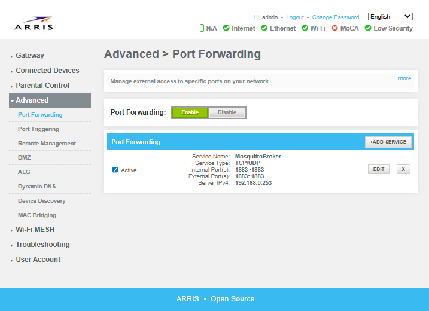

*An example of the port forwarding screen of my router's interface.*

Once the port forwarding is set up, you can then use MQTT Explorer to connect to the broker via your external IP (this can be found at https://www.whatsmyip.org/). To further prove that you can access the broker from anywhere with an Internet connection, download an MQTT app for your phone and disconnect your phone from your Wi-Fi so it's on your mobile service provider's data connection. Then test the broker connection through your phone app.

> **Note:** There are several MQTT apps out there for Android and iOS. Some of them are OK, but I really don't like any of them too much. I'll elaborate more on this later, but at this step it is worth mentioning that [MyMQTT](https://mymqtt.app/en) is the Android app that I found to be the most usable. 

A quick note on security. It's best practice to close all unused ports. Therefore, if you get all this up and running and set the project aside for a couple months like I did, it's a good idea to deactivate the service or simply disable port forwarding on your router altogether until you're ready to continue. 

## Setting Up Node-RED
Node-RED is a "flow-based, low-code development tool for visual programming, originally developed by IBM for wiring together hardware devices, APIs and online services as part of the Internet of things." ([Wikipedia](https://en.wikipedia.org/wiki/Node-RED))

Node-RED came preinstalled on my Raspberry Pi, and it likely is on yours too. In the event that it isn't, visit the [official Node-RED documentation](https://nodered.org/docs/getting-started/raspberrypi) to get it installed. That article also says that you can set up Node-RED to autostart on system boot of the Pi with the following command:
```
sudo systemctl enable nodered.service
```

I could not get it to work using this command. Instead, I wrote a very simple bash script that contained nothing more than the line `node-red` and saved it to `/home/raspberry/Documents/scripts/node_red_startup.sh`. 

I then opened up my crontab in the nano editor with the command `crontab -e` and added the following line to the end of the file:
```
@reboot sh /home/raspberry/Documents/scripts/node_red_startup.sh
```

I saved the file and rebooted the Pi and it worked. 

To view the Node-RED interface, open the web browser to http://localhost:1880. From there you can make a very simple flow to subscribe to your broker and output the message contents to the debug window. With this step complete, I then shifted my focus to transmitting the RF signals using the Pi. 

## Writing the RF Transmit Script
### Determining the Correct Signials
As mentioned in the [Background](#background) section above, I had already cloned the main RF signals of the remote (on, off, white, red, and blue) using the Flipper Zero. I was able to easily get the files for these cloned signals onto my computer using the [qFlipper app](https://docs.flipper.net/zero/qflipper). The files contain several pieces of information about the signals, but the most important parts are the protocol (e.g. Princeton 24bit), the frequency (**NOTE TO AUTHOR: Or is it bandwidth??**) (e.g. 433.92 AM), and the "key", which is a hex representation of the signal pattern (**NOTE TO AUTHOR: Confirm this is accurate and get more official terminology**). 

The Flipper actually tells you everything you need to reproduce the signal. However, I couldn't find explicit documentation on understanding and reproducing a Flipper Sub-GHz file on the Raspberry Pi, so I used some other techniques and followed some other guides to confirm I had the correct information.

> NOTE TO AUTHOR: Maybe put some screenshots in here of the files.

Many of the guides and tutorials I found online also set up a way to receive the RF signals on the Raspberry Pi. Luckily, most of the hardware devices come in packs with multiple sets of both transmitters and receivers. Just search amazon (or better yet, the Internet outside of amazon) for "433 MHz transmitter" and you should find a number of packs. [This pack](https://www.amazon.com/HiLetgo-Wireless-Transmitter-Receiver-Raspberry/dp/B01DKC2EY4/) is the one that worked for me, at least at first. They seem to be fairly underpowered (more on that later), but they worked well enough for me to move forward with the project. 

The first way I confirmed the information on the Flipper file was to follow an article on Instructables titled [Super Simple Raspberry Pi 433MHz Home Automation](https://www.instructables.com/id/Super-Simple-Raspberry-Pi-433MHz-Home-Automation/). Unfortunately, it appears the article is no longer up as of this writing (Dec, 2025), so I'll give a brief summary here.

The article is broken into two main sections: receive and transmit. The first section, receiving the signal, wires up the RX hardware to the Pi and uses a script to capture the RF signal and graph the results using Matplotlib. It then explains that an RF signal works by interpreting a pattern of high/low signals. The pattern is made of a combination of short signals and long signals, often preceded by a preamble to let whatever is receiving the signal know that what's about to follow is the data. Different protocols will use different combinations of high/low and long/short signals to signify a 1 or a 0. To decode the signal, you just need to view the pattern and write down either a 1 or a 0 each time you see a long-high to short-low or a short-high to long-low, for example. It may sound like this method is tedious and not guaranteed, which is correct. However, after going through it multiple times I ended up with consistent results. I used an online binary to hex converter to translate the binary code I kept getting from the graph, and it matched up with the hex value in the Flipper file!

> NOTE TO AUTHOR: Review how the RF signals work and write up a better explanation. Don't just link the reader to external articles and videos.

If you're interested in diving deeper into the analysis of the RF signal, by all means, go ahead. It's actually really interesting. I found a number of YouTube videos by [Derek Jamison](https://www.youtube.com/@MrDerekJamison) that dive deep into the Flipper Zero and how it analyzes RF signals. [This one](https://www.youtube.com/watch?v=ojpc7Q2fjS8) in particular is a great one to start with and explains how the signals work (probably in a better way than I just did). Some of his other videos also explain the "Read RAW" feature, which was actually another way that I confirmed I was using the correct signal.
However, for the purpose of this project, these were just a ways to confirm that the hex value from the "key" of the Flipper file was actually the signal that I would need to transmit to the lights. 

Once I was confident about the signal I needed to send, I then swapped out the RX hardware for the TX hardware and wired it up to the Pi. I actually got hung up on this part of the project for quite a while. Looking back, this was definitely the crux of the whole project for me. 

> NOTE TO AUTHOR: Describe how the hardware is wired to the Pi. Find a good picture of the pinout.
> Also use pictures of the final setup.

### Confirming the Script Works
Getting the timing right for the signal lengths (short vs. long in ms) proved to be pretty tricky. However, after some trial and error and a little help from some AI to analyze my flipper files and my working python script, I landed on a python library to do the heavy lifting of the RF transmission. The library is `rpi_rf`. If I recall correctly, this library was pre-installed on my RPi. If it's not on yours, you can install it with `pip install rpi-rf`. Notice the dash (`-`) in the pip install command as opposed to the underscore (`_`) that should be used in the import statement (`from rpi_rf import RFDevice`). Documentation for this library can be found on [pypi](https://pypi.org/project/rpi-rf/) and [GitHub](https://github.com/milaq/rpi-rf).

To test that I was sending the correct signal, I set up my Flipper Zero to listen for RF signals next to my RPi transmitter. After working out the bugs in my script the Flipper sounded the alert that it had captured a signal. I checked the hex value of it and it matched the one I sent from the python script! Since the lights did not turn on when I successfully captured this signal, I assumed the transmitter was not powerful enough to reach the RF receiver on the patio lights. Maybe it was my poor soldering skills, or maybe it was my lack of knowledge, but every time I tried to solder an antenna to a transmitter to extend the range I seemed to fry it. I then found a workaround by finding a spot in my bedroom that was close enough to the patio lights receiver for the RF signal to reach it, yet close enough to the wall of my home office so that I could reach the Pi from the keyboard and monitor in my office via a bluetooth connection (this makes it much easier to work on, since my bedroom isn't really set up with a desirable space for computer work).
> Pro Tip: I found a bluetooth [keyboard with built-in touchpad](https://www.amazon.com/Bnnwa-Multi-Device-Bluetooth-Touchpad-Wireless-Multi-Touch/dp/B0D5CR6Y47) to control the Pi. I also got a wireless [HDMI transmitter/receiver](https://www.amazon.com/Wireless-Transmitter-Receiver-Portable-Streaming/dp/B0DBPTCQDC/?th=1) and an [HDMI switch](https://www.amazon.com/Anker-Bi-Directional-Switcher-Compatible-Projector/dp/B0CJT6JBM8/?th=1) to alternate my 2nd monitor between the Pi and my desktop in my home office. Those products aren't the only ones out there, and you may be able to find better deals, but those are the ones I ended up getting.

The script is very simple and reusable. It uses [`argparse`](https://docs.python.org/3/library/argparse.html) to accept an argument representing a command to forward to the lights. The argument given to the script is a string (on, off, blue, white, etc.). The script stores a dictionary mapping expected string commands to the hex code values of the different signals. After confirming that the string represents a valid key, the hex value is then transmitted via the `RFDevice` class of the `rpi_rf` module. 

The most up-to-date version of the script can be found [here](https://github.com/sweisss/rpi-smart-hub/blob/main/rf_transmit.py).

With the python script successfully transmitting the RF signals to the lights, and my work station connected to the Pi from the other room, it was now time to return to Node-RED and start putting it all together. 

## Putting It All Together
### Confirming MQTT Connections with MQTT Explorer and Android App
The first step I took to incorporate my python script into the Node-RED flow was to call it from a simple `exec` node and activate that node from a simple `inject` node. After confirming that the lights would respond correctly to the signals triggered through Node-RED, I then hooked it up to the `mqtt in` node described earlier. I added some string parsing and error checking to make sure it would only call the `exec` node with valid arguments, and then tested it by sending the commands through the MQTT Explorer app on my desktop. 

From here, I started testing it with various MQTT apps for my Android phone. As mentioned earlier, the end goal of this project is to control the lights from anywhere with an Internet connection (i.e. mobile data connectivity). Also as mentioned earlier, I did not like any of the MQTT apps available for Android devices that I found. I thought about making my own custom Android app, and I still might eventually do that. However, I realized it would be much quicker and easier to set up a private Discord server and make a Discord bot that could relay commands and the status of the lights. This turned out to be a very fun part of the project. 

### Creating the Discord Bot
I created the Discord bot in three basic steps. First, I made a dedicated server for the bot. Then I made the bot on Discord's [developer website](https://discord.com/developers). Once both the server and the bot were created, all I needed to do in the third step was to invite the bot to the server. 

- #### Create a Dedicated Server
  Creating a personal Discord server is very straightforward. If you haven't done so yet, all you need to do is simply click on the circle icon with the plus (+) in it at the bottom of the list of your server icons.

  

  After you click on it, a menu will pop up with the option to "Create My Own" and after a few more clicks you'll have your own server. Add an icon image for your server so it stands out in the list, and a channel for each device that you want to control to keep things organized (if you want to organize it like I did, it's completely up to you). 

- #### Create the Bot
  With my dedicated Discord server up an running, I then began to set up the bot. This can be done from the developers section of the Discord website. The helpful docs page can be found [here](https://discord.com/developers/docs/intro). The [Applications](https://discord.com/developers/applications) page can be reached at the top of the left-hand navigation menu. You will need to log in with your Discord account credentials to reach this portion of the website. 

  Once logged in on the Applications page, click on the blue "New Application" button on the upper-right. You will be prompted to give the app a name. I chose "RPi Messenger" since this app would essentially serve as a messenger between my phone (or computer) and the Raspberry Pi. After agreeing to the Terms of Service and confirming that you're a human, the "General Information" screen for the app will be displayed. Use the navigation menu on the left to move to the "Bot" page under the Settings section.

  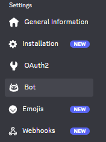

  Give the app an icon image so it stands out, and a banner for a nice touch. I gave it the same one that I gave my server: a fun image of a finger with a happy face drawn on it and wearing a raspberry as a hat. 

  

  Beneath this area will be an entry box to update the bot's Username. I kept it the same as the Application name (the default setting). The next item on the settings menu is the "Token". If you see the token value and a blue "Copy" button, click copy and immediately save it somewhere safe. It will only be shown once and you will need to reset it if you lose it. If it's already hidden and you only see the blue "Reset Token" button, go ahead and reset it. You will need to enter your password in order to reset it. I had to reset it a couple times. It's a bit of friction, but overall inconsequential if the bot is still new and nothing else depends on the token yet. Below is an example of the token from a throwaway test bot I made.

  

  To make things easy, I kept "Public Bot" checked and "Requires OAuth2 Code Grant" unchecked considering I don't intent to invite anyone else to the dedicated server this bot is on and don't intend to invite the bot to any other servers. 

  

  In the "Privileged Gateway Intents" section, make sure that "Server Members Intent" and "Message Content Intent" are checked. These are necessary for the bot to receive the content of messages sent in the server channels. 

  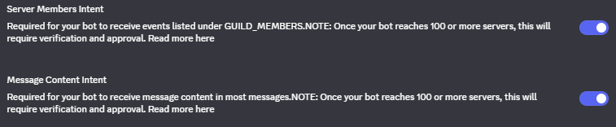

  Make sure to save any changes. 

- #### Attach the Bot to the Server
  The final step in setting up the bot is to invite it to the dedicated Discord server. To do this, move from the "Bot" page up to the "OAuth2" page of the left-hand navigation menu and scroll down to the "OAuth2 URL Generator" section. Under "Scopes" check to box for "bot". 

  

  After selecting the "bot" checkbox, a new section will appear named "Bot Permissions". 
  To allow the bot to send and receive messages back and forth between Node-RED and Discord, I selected "View Channels", "Send Messages", and "Read Message History". If you want your bot to have additional abilities, check the appropriate permissions boxes in this section.

  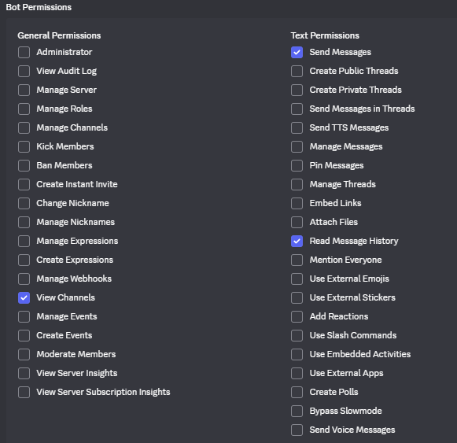

  At the bottom of the page will be a Generated URL. Copy this and enter it into a new tab in your web browser. It will display a few more confirmation screens to authorize the bot. Once authorized, the bot will be added to the server!

### Integrating the Bot to Node-RED
There are several node libraries that integrate Discord with Node-RED. My RPi seemed to be a bit dated, and while several were searchable from the Node-RED "Manage palette", all but one required me to update my underlying NodeJS version for them to work. I decided to go with the one library that did not require fully updating NodeJS and Node-RED: [node-red-contrib-discord 5.0.0](https://flows.nodered.org/node/node-red-contrib-discord). That library hadn't been updated in nearly 5 years. It is definitely a little buggy, but it serves its purpose for my project and hasn't yet given me enough trouble to force me to try a more recently maintained and updated one. 

The Discord library is fairly simple to use. You just need to create a `discord-token` node with the token you saved when creating your bot and give it a helpful name. This `discord-token` node can be created within (while setting up) a `discordMessage` node or a `discordSendMessage` node, which simply listen for and return messages or send out message payloads, respectively.

From here I set up two main sections of the flow. The first section starts by using the `discordMessage` node to listen to commands sent via the Discord bot. It then passes the message payload through a series of string parsing and verification nodes. If the received command is valid, it is forwarded to the MQTT broker. If the command is invalid (for example, I often send "test" to simply see if the bot is responsive), it returns a message listing the valid command options. 

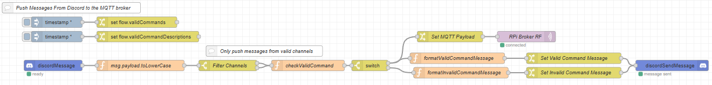

The second main section of the Node-RED flow starts by subscribing to the MQTT broker. Any messages published by the broker will be received by this node and go through some string parsing steps before being forwarded to an `exec` node to call the python script that sends the RF signals. Even though the incoming Discord messages are validated before being sent to the MQTT broker, there is a potential that the broker could receive an invalid message from a third party method (like MQTT Explorer). However, the python script itself also has error handling and will return an exit code of 1 if a valid command was not successfully received and sent. More string parsing steps follow to combine the return code from the `exec` node with the command from the `mqtt in` node and build a nice, readable message about the status of the action (whether the script completed successfully or not). The `discordSendMessage` node then sends this message out to the Discord bot. 

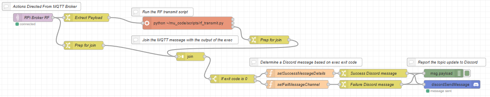

See the [Results](#results) section for an image of these flow sections in the full flow context. There is also an image posted in the [GitHub repository](https://github.com/sweisss/rpi-smart-hub/blob/main/PatioLightsFlow_1-17-26.png) of the project. 

### Replacing the MQTT Android App
At this point, the Discord server and bot became my primary means of communication with the RPi, essentially replacing the user-unfriendly MQTT Android apps. Rather than communicating with the broker directly, the Discord nodes communicate with the Discord server via websockets and HTTPS (**NOTE TO AUTHOR: Look into this deeper**). It's best practice to only expose ports that are regularly being used or are essential for the services to run correctly. Therefore it's a good idea to go back to the router interface and close the port exposing the broker to the public-facing Internet (1883). 

Because I am now utilizing the Discord bot as the main communication with the RPi, the MQTT broker could probably be bypassed altogether. This would certainly simplify the Node-RED flow and the overall project. However, I decided to keep the MQTT broker for a couple reasons. First, I still have the idea of possibly making a custom Android app that would utilize MQTT to communicate with the RPi. Second, the bugginess of the Discord node library has given me the attitude that it is nice to be ready with backup methods of communication. If you're using this writeup to influence your own project, weigh these options and make the decision that makes the most sense for your situation. 

## Addressing Stability Issues
Several issues caused the RPi to periodically lose connectivity. Through hours of troubleshooting, I ended up with the following solutions. 

### Disable Wi-Fi Power Management
Wi-Fi Power Management is enabled by default on the Raspberry Pi. This is likely because these devices are often used in restricted power scenarios. After all, it's a fanless board with light-weight components, not a gaming PC. Wi-Fi Power Management allows the Pi to put the Wi-Fi adapter into a sleep state to conserve power. Unfortunately, keeping this setting on can cause issues when constant connectivity is desired (like when I want to turn on or off the lights at random hours throughout the day). In order to disable this feature, I did the following.

First, I checked to make sure it was on, and then turned it off with the following commands:
```
# Check Wi-Fi power saving (if using Wi-Fi)
iwconfig wlan0  # Look for "Power Management:on"

# Disable Wi-Fi power management
sudo iwconfig wlan0 power off
```

For a more permanent solution, I created two services in _/etc/systemd/system/_. The first was _wifi-powermanagement-off.service_:
```
sudo nano /etc/systemd/system/wifi-powermanagement-off.service
```

I then added the following:
```
[Unit]
Description=Disable Wi-Fi Power Management
After=network.target   # NOTE: I had a typo in netwrok. It is likely that this is why I made two services.

[Service]
Type=oneshot
ExecStart=/sbin/iwconfig wlan0 power off
RemainAfterExit=yes

[Install]
WantedBy=multi-user.target
```

As noted in the code block, I had a typo (`netwrok` instead of `network`) that went unnoticed for months. It is likely that this typo was the reason that I made two services, making the second one because the first one likely did not solve the issue. I have fixed the typo in this code block for clarity. If this corrected code block does not work for you, try the next one. 

The second service I created was _wifi-powersave-off.service_:
```
[Unit]
Description=Disable Wi-Fi Power Save
After=network.target

[Service]
Type=oneshot
ExecStart=/usr/sbin/iw dev wlan0 set power_save off
RemainAfterExit=yes

[Install]
WantedBy=multi-user.target
```

With these two services in place, the intermitted connectivity issue was solved for a bit. However, this was not the only thing that caused connectivity issues for me.

### Use a Wi-Fi Antenna to Avoid Interference
After replacing an old Vizio soundbar with a Sonos surround system and roaming  speaker, I noticed that I was starting to have connection issues with the Pi again. It seemed that it would lose connection when all the Sonos speakers were active, but if I turned one off, the Pi would be reachable again. After a bit of research, I determined this issue to be the result of a crowded network. To solve this, I ordered a [Wi-Fi antenna](https://www.brostrend.com/products/ac5l) so that the Pi could join my 5G network which is much less crowded as most of my devices in my house (Sonos speakers included) only have the ability to join the 2.4GHz network. There are many Wi-Fi antennas out there. At the time of solving the issue, [this one](https://www.brostrend.com/products/ac5l) made the most sense. At the time of writing, there are many better deals out there. 
> **Note:** Once adding in the Wi-Fi antenna, `wlan1` became the primary network interface since on my RPi `wlan0` is associated with 2.4GHz and `wlan1` is associated with 5GHz.

### Setting a Static IP in the Router Interface
A few months after getting the Discord bot and schedule working, I ran into an issue where the Raspberry Pi was assigned a new IP address on my home network. I looked into setting up a self-hosted DNS server to prevent this issue, but a much quicker and easier workaround was to simply register the IP as static in my home router's interface. On my router interface, this can be done by selecting "Static Addresses" under the "Connected Devices" section of the left-hand navigation bar. From there, you can click on the button to manually add a static device and enter the appropriate information.

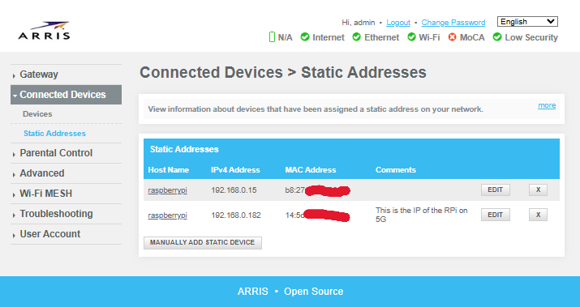


### Configure a Static Fallback
After several months without issue using the static IP address reserved in the router interface, the Pi suddenly started having connectivity issues again. It was different this time. The Discord bot would be unreachable, as would the Node-RED interface from another computer on my network. When I would connect my screen to the Pi It would show that it was still connected to my home network, but no longer had an IP address. It turns out that the static IP reservation in the router doesn't prevent DHCP lease expiration. Rather, it just ensures the Pi always gets the same IP when it successfully requests one. In short, the Pi itself would be looking for a new IP from DHCP, but without a static fallback set up on it it would just lose the IP address. To fix this, I added the following to _/etc/dhcpcd.conf_:
```
# wlan1 Setup
# wlan1 configuration
interface wlan1
# Increase timeout for slow networks
timeout 60
# Disable rapid commit - can cause issues
nooption rapid_commit
# Persistent retry on failure
persistent 

# Static fallback profile
profile static_wlan1
static ip_address=192.168.0.182/24
static routers=192.168.0.1
static domain_name_servers=192.168.0.1 8.8.8.8

# Apply fallback to wlan1
interface wlan1
fallback static_wlan1
```

As an additional insurrance, I made sure `dhcpcd` was up to date with the following commands:
```
dhcpcd --version
sudo apt update
sudo apt upgrade dhcpcd5
sudo apt upgrade dhcpcd
```

I then restarted the service with the following commands:
```
sudo systemctl restart dhcpcd
sudo systemctl status dhcpcd
```

In the output, there was a line that read 
```
wlan1: leased 192.168.0.182 for 3600 seconds
```

This is a 1 hour lease time, which is apparently very short and explains why I would lose connectivity multiple times per day.

After making these changes, I set up some live monitoring with the command:
```
sudo journalctl -u dhcpcd -f
```

The idea here is that if the issue persists, it should fail in every 2 hours and the live monitoring of the `journalctl` would display this. I also decided to leave the Pi alone for 30 minutes and then check for renewal attempts with the command:
```
sudo journalctl -u dhcpcd --since "17:39" | grep -i "renew\|rebind\|lease"
```

Life got in the way and I got sidetracked by many distractions and didn't get around to checking the results of these `journalctl -u` commands for 2 weeks rather than 2 hours. However, the Pi and communications with the Discord bot appeared to maintain connectivity throughout this time. When I finally did pull up the Pi's GUI to check on it 2 weeks later there was only one DHCP lease expiration and reassignment from that initial night just before 10:00 pm. I decided called the issue solved (at least for the moment). 

## Polishing and Final Touches
### Utilizing Environment Variables
Because the Discord node requires the bot's token to be saved, it's good practice to save the token as an environment variable and reference this variable to configure the node. This ensures that the token is not accidentally included in the JavaScript code of the flow and won't be accidentally distributed to GitHub or any other repository where the flow code may end up. However, anyone with direct access to the Node-RED interface of your system can read the environment variable with a simple `Debug` print node. Keep this in mind if you plan to expose the port that your Node-RED service is running on. 

To set up an environment variable, open up _~/.node-red/settings.js_ in your favorite text editor. At the top of the file, add the line:
```
process.env.DISCORD_TOKEN = '<token>'
```

You can replace `DISCORD_TOKEN` with any variable name you'd like.

To reference the environment variable in Node-RED, simply use the syntax `${VARIABLENAME}`, or `${DISCORD_TOKEN}` in this case. 

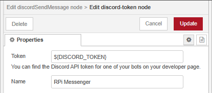

For more details on using environment variables in Node-RED, see the [official docs](https://nodered.org/docs/user-guide/environment-variables).

### Building a Schedule
I quickly wanted the lights to do more than simply turn on or off on command. I thought it would be great if I could also set up a schedule like my front porch light (which is controlled by a commercial IoT smart switch). The switch that controls my front porch light, however, has the limitation that I need to change the "on" time every few days during shoulder seasons when the sunset time is rapidly changing. After a few weeks of updating my "on" time for the front porch and now patio lights in Node-RED, I decided it would be a much better idea to set it based off of the sunset time for that day. I did this with the `HTTP request` node.

Every day at 1:00 am, the flow sends a request to [timeanddate.com](https://www.timeanddate.com/). You can find a list of U.S. cities [here](https://www.timeanddate.com/astronomy/usa). I chose the page for my specific city to send the HTTP request to. After the HTTP request, I have a node to check for a `200` response code. Any code other than a `200` will result in setting the "on" time for "4:30" pm (at least for the Winter). If the HTTP request does return `200`, the data gets passed through a few more nodes to parse the response and get the scheduled time of sunset. From there, the flow calculates and sets a delay based on the current time (1:00 am) and the sunset time. Once the delay has completed, the flow continues with sending the "on" command to the MQTT broker. 

### Adding a Nightlight
Part of the reason I originally wanted to use my Raspberry Pi and create a smart hub rather than simply trying to use a Wi-Fi smart switch plugged direcly into the patio lights was so that I could expand it to other devices. The next device I wanted to include in the system was a little [IR controlled orb](https://www.amazon.com/Cordless-Changing-Remote-Rechargeable-Bedside/dp/B0BVYHQ64S) that I had left over from a Halloween costume and had been using as a nightlight. The "on" and "off" signals of this nightlight were some of the first that I captured on my Flipper Zero, so moving these files over to the Pi was no issue. However, I ran into some issues with transmitting the signal from the Pi. I also found it difficult to find a location for the Pi and its attached breadboard that could reach the RF receiver of the patio lights, be close enough to my home office for the wireless HDMI transmitters to communicate, and maintain a clear line of sight to the orb nightlight. I ended up solving this issue by replacing the IR controlled light with a small [USB LED](https://www.amazon.com/Febrytold-Interior-Atmosphere-Universal-Decoration/dp/B089K6WJ5J/ref=sr_1_6?sr=8-6) that I plugged into an [RF controlled USB switch](https://www.amazon.com/URANT-Wireless-Frequency-Transmitter-Receiver/dp/B0F2HP1D8L/ref=sr_1_4). As a bonus, this USB LED and switch take up much less space on my night stand and keep the clutter down.

It was a very simple and straightforward process of capturing the RF signals for the switch with the Flipper Zero and adding the hex codes from them to the list of options in the python script on the Pi. I then added in a second channel in the Discord server for the `#nightlight` and added a new branch to the Node-RED flow. I now can control each light through its own respective channel on the Discord server. 

### Adding Helpful Error Messages
As the number of commands and devices expanded, I found it helpful to write some help messages that the Discord bot could return if an incorrect command was sent to a device. I thought it would look good for the bot to respond to an invalid command with a CLI inspired help message. Writing this help message turned out to be a bit tedious. I wrote the message as a [JSONata](https://jsonata.org/) expression and needed to add a `\n` any time I wanted a newline in the message. After some trial and error, it looked good enough to ship. I alo decided it would be a nice touch to repeat the invalid command in the help message. 

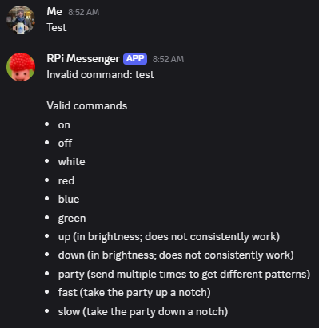

After setting up error messages that I felt satisfied with, I decided to take the messages to another level and use a similar technique to allow the bot to confirm a valid command before performing the action and reporting back on the result. A series of nodes to parse the device channel as well as the command gives a nice, personalized look to the responses.

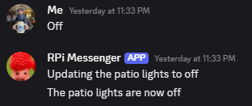
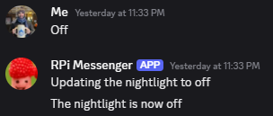

### Adding Nightlight "On" to the Schedule
Like many people, I often have trouble waking up and getting out of bed in the morning. Turning on the lights definitely helps with this, especially when my first few alarms are set to times before sunrise. I decided to add a daily "on" command for the nightlight at the time of my first alarm to help initiate the waking up process and to try to prevent me from going back to sleep. 

### Cat-Proofing the Hardware
The RPi and breadboard with the RF transmitter on it sit on a dresser just beneath a large window in my bedroom. This is because it is the only place I could find where the underpowered RF transmitter can still reach the patio lights and night light receivers, yet the wireless transmitter and receiver for the monitor and keyboard in my home office would still be able to communicate. I never felt comfortable leaving it here since it is a window that my cats commonly like to hang out in. The dresser also tends to collect clothing and other random things that don't immediately get put away where they belong when they are done being used. Furthermore, the dresser does not sit flush with the wall because of the baseboard. While this is nice for running wires behind the scenes, it also leaves open a risk that my curious and careless cats (and I) might knock the breadboard and RF transmitter into the crevasse behind. 

While attempting to troubleshoot the transmission distance with various antennas one day, I decided to make a quick housing for everything out of a couple boxes left over from some online shopping. It's not the most elegant looking solution, and as everyone knows, cats love boxes, so it's still not 100% cat-proof. However, the box provides much more assurance from accidentally knocking wires loose or dropping pieces of hardware behind the dresser. 

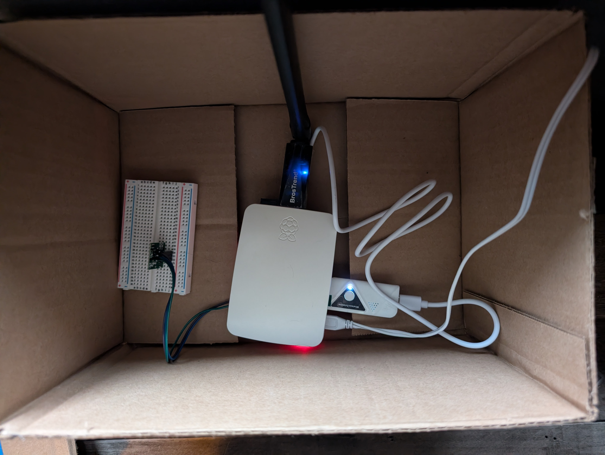

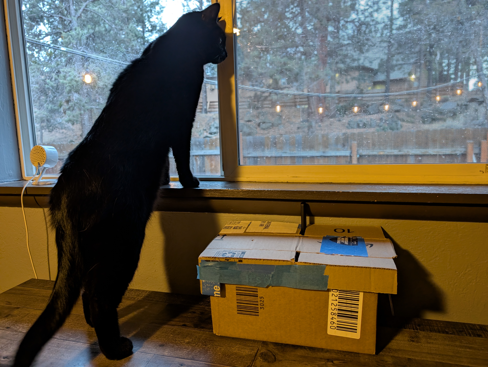

## Results
The most up-to-date python code and Node-RED flow can be found on [this GitHub repository](https://github.com/sweisss/rpi-smart-hub/tree/main). 

Here is an image of the current Node-RED flow. Part of what makes Node-RED so great is that you can visually follow the logic and understand how the program works. 

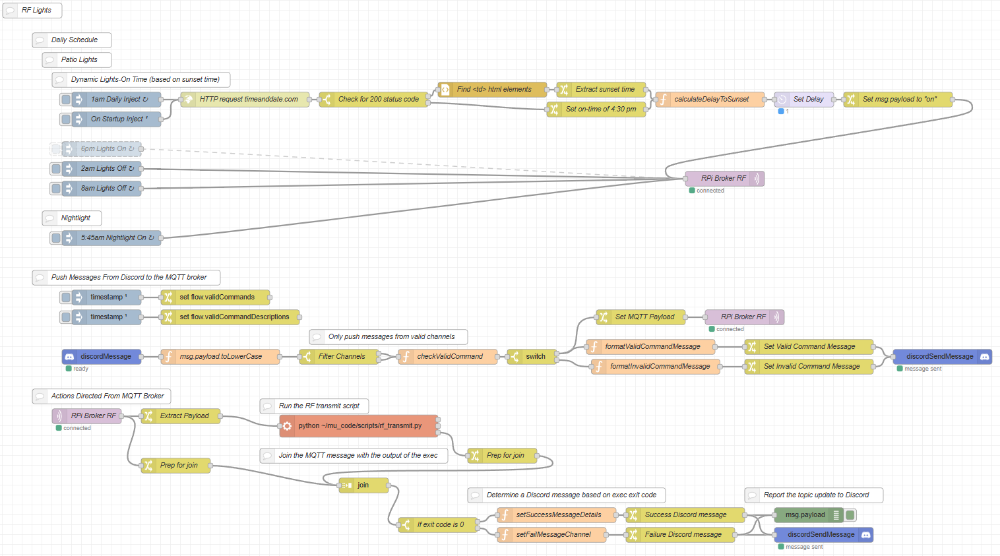

## Future Expansion
### Add Self-Hosted DNS
As mentioned earlier, I considered self-hosting a DNS server to prevent the RPi from being assigned a new IP at inconvenient times. Assigning a static IP through the router interface provided a much easier solution. However, making a self-hosted DNS server is a great project and learning experience and is therefore still on my list of future expansions. 

### Strengthen the RF Signal
Either from my lack of soldering skills or from my misunderstanding of how the RF transmitter chips work, every time I tried to attach an antenna to the chip I seemed to fry it and it would not send out the RF signal. Improving the strength of the signal would greatly increase the possible locations where I can store the device. The main concern right now is that it is fully accessible by my cats...

### Get a Proper Housing for the Components
The box mentioned [above](#cat-proofing-the-hardware) in the [Polishing and Final Touches](#polishing-and-final-touches) section provides a nice, temporary solution for preventing my cats (or myself) from messing with the hardware, pulling wires, and/or dropping it behind the dresser where it sits. However, I would like to make a more elegant solution. Something like a custom made wooden or 3D printed box would look a lot nicer as well as provide more strength to hold up against prying paws. Strengthening the RF signal would also increase the number of locations where I could store the setup and would therefore influence the design of the housing. 

### Add Ceiling Fan Control
My ceiling fan is also controlled with an RF remote. Unfortunately, the frequency this remote works on (300.00 MHz) is not in a range that is legal for "amateur" use. Even though I've captured the signals from the fan, I cannot emulate the signals on the Flipper Zero because I have the stock firmware on it. A chart of frequency allocations in the U.S. can be found [here](https://www.ntia.gov/files/ntia/publications/2003-allochrt.pdf). I would like to find an RF transmitter that can send this frequency and include it in the project. This would not only allow me to control the light and fan speed from other rooms, but I would also then be able to enhance my "lights on" morning alarm. 

### Add Front Porch Light Control
Including control of the front porch light is currently one of the more interesting expansions for this project and is likely the next one I will tackle (other than maybe cat-proofing the hardware). The light is controlled by a switch that is powered by [eWeLink](https://ewelink.cc/). There are some Node-RED libraries out there for eWeLink devices. However, they all appear to be out of date and the protocol that eWeLink uses appears to have changed. Another option is somehow integrating the Pi or the Discord bot with Home Assistant. A third option that I am very intrigued by is setting up a device to act as a proxy or a MitM and capture the data entering and exiting the smart switch. Once the protocol is understood and the data has been captured, it should then be possible (hopefully) to replicate the signals from the Pi. I really like this idea because it combines several interests of mine, including DIY, IoT, reverse engineering, and security.  

### Build an Android App
As mentioned at the beginning of this writeup, having a custom Android app to send the MQTT signals is completely feasible and is probably good practice for my mobile development skills. However, the Discord bot works well enough that this future expansion is at the end of the list. 

-----

[Home](https://sweisss.github.io/) &emsp; &emsp;
[Personal Projects](https://sweisss.github.io/#personal-projects) &emsp; &emsp;
[OSU Projects](https://sweisss.github.io/#oregon-state-university-projects) &emsp; &emsp;
[Element 1 Projects](https://sweisss.github.io/#element-1-projects) &emsp; &emsp;
[Videos](https://sweisss.github.io/#videos)

(C) Seth Weiss, 2025
