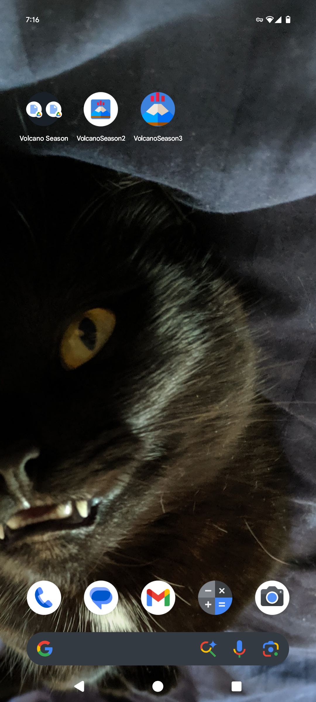
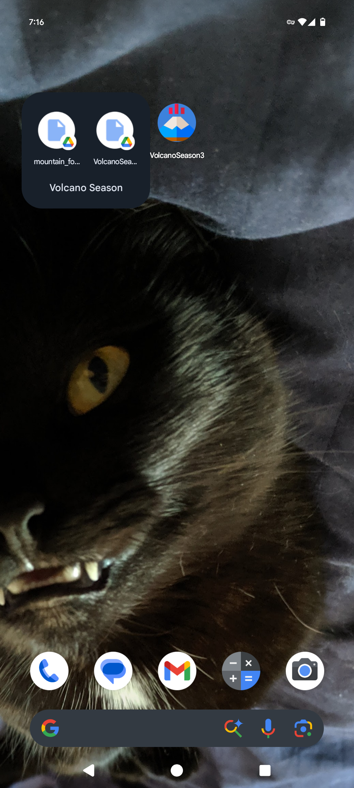
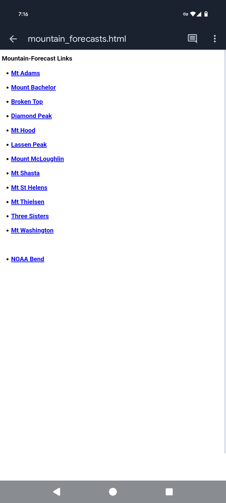
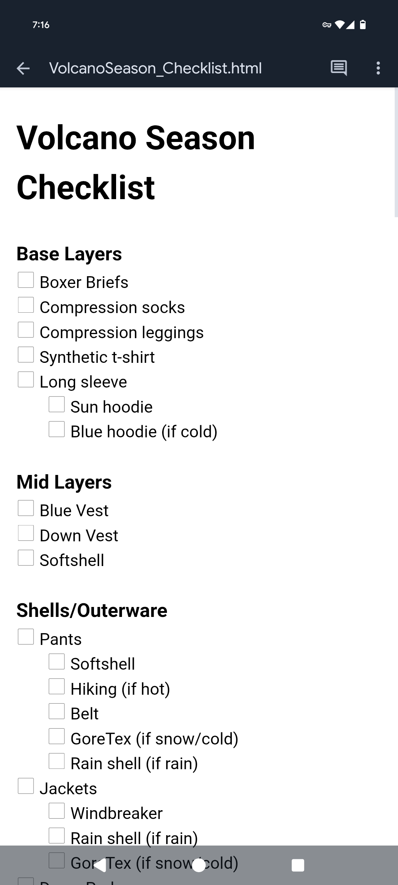

# Volcano Season 3

**NOTE: This is a rough draft and needs to be completed!**

## The Origins
Volcano Season first started as a pseudo-app for an Android phone. 

### Where The Idea Came From
Every Spring in the Pacific Northwest, I like to partake in what is known as "Volcano Season":
When the large and prominent volcanoes of the Cascades mountian range are no longer surrounded
by severe Winter storms and are more safely accessible for climbing and skiing. This, however,
does not make skiing a volcano risk-free, and a lot of things need to line up for a successfull trip.
One of these many factors that needs to line up is the weather, and many serious volcano season skiers
will find themselves constantly checking the weather forecasts for multiple volcanoes throughout each day
for an period of 3-4 months. 

To be a little more efficient with my compulsive forecast checking, I thought it would be a good idea
to have some sort of quick-link list to all the volcanoes rather than needing to enter the name of each one
and repeatedly conduct multiple searches. 

### The Light Bulb Ignites
After completing the introductory class to web development at OSU-Cascades,
I realized that I could make a simle HTML file that linked to all of the forecasts of the
volcanoes I was frequently checking. I then realized that I could not only save and render 
this HTML file in a Google Doc, but that I could save the file directly to the homescreen
of my Android phone. I then took this momentum and made an equipment checklist using both 
HTML and CSS. Again, I saved the Google Doc to my home screen.

The real "AH-HA!" moment came when I realized that I could group these two Google Docs
together on the homescreen. I then had quick and easy access to both the list of
forecast links and the equipment checklist! I used this pseduo-app for a little over
a year before I had the opportunity to take the next step. 

<!-- Render images as html (side-by-side does not seem to work here) -->
<!--

-->

<!-- Render images in a markdown table -->
<!--
             |  
:-------------------------:|:-------------------------:
  |  
-->

<!-- Render images in a 
 tag -->

  
  

_The three versions of the VolcanoSeason app on my phone homescreen (don't mind my Motorhead-looking cat in the background).
The original pseudo-app comprised of a group of Google Docs is on the left. The second versions is in the middle (a recent
Android update appears to have affected the logo). The third app version is on the right.
When the pseduo-app group is clicked, it slightly expands to give the user an option of which Google Doc to open (pictured on the right)._

  
  

 

_The VolcanoSeason pseudo-app opened as HTML rendered in Google Docs._

Find the pseduo-app on [GitHub](https://github.com/sweisss/VolcanoSeason)

### Teaching Myself Kotlin
In July of 2022 I contracted COVID-19 and wasn't able to do much other than lay on my couch for 4 days.
However, I used this opportunity to read a bunch of articles and watch a bunch of YouTube tutorials
to teach myself Kotlin and Android studio and turn the psedo-app into a real Android app. 
It was a very primitive app, and the equipment checklist was just the same stateless HTML/CSS file (albeit this time
saved in the app itself rather than Google Docs), but I thought it wasn't bad considering it was made in 4 days
with COVID-19 in a language and framework that I had never used before. I was proud of it,
but I knew I wanted to improve on it when I had more time. 

Find version 2 on [GitHub](https://github.com/sweisss/VolcanoSeason2)

## The Big Leagues
In June of 2024 I crashed my bike and spent 4 weeks on my couch in a neck brace and a
back brace (sensing a theme here?). I used this opportunity to apply the knowledge and skills
I gained about Android development from the preceding winter quarter at OSU and recreated the
primitive 2nd version into a professional-looking, portfolio-worthy app.

Volcano Season 3 is simple but highly customizable. It utilizes Material cards and RecyclerView
to hold a list of links to forecasts. Each forecast link can be categorized as either a volcano (🌋)
or a region (🌤️). The forecasts can also be organized alphabetically listing regions first, volcanos first,
regions and volcanos fully integrated, or customized drag-and-drop so the user can organize them according to
personal relevance. 

The equipment checklist now utilizes an expandable list for better viewing and navigation. Unlike the previous app versions,
The app leverages Room Database to keep track of the state of the checklist items which now persists across app restarts.
The user can also now add and remove checklist items at will. 

> **Note:** Add screenshots!

Find version 3 on [GitHub](https://github.com/sweisss/VolcanoSeason3)

-----

[Home](https://sweisss.github.io/) &emsp; &emsp;
[OSU Projects](https://sweisss.github.io/#oregon-state-university-projects) &emsp; &emsp;
[Personal Projects](https://sweisss.github.io/#personal-projects) &emsp; &emsp;
[Element 1 Projects](https://sweisss.github.io/#element-1-projects) &emsp; &emsp;
[Videos](https://sweisss.github.io/#videos)

(C) Seth Weiss, 2025
